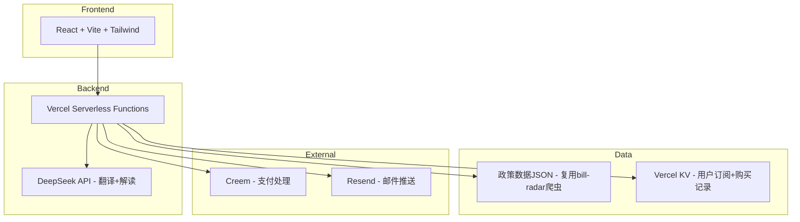

# 技术架构: China Policy Guide for Expats

## 1. 架构设计



## 2. 技术说明
- 前端: React@18 + Tailwind CSS@3 + Vite
- 后端: Vercel Serverless Functions (TypeScript)
- 数据库: Vercel KV (Redis) + 静态JSON文件
- 支付: Creem (Merchant of Record, 身份证即可开户)
- 邮件: Resend (免费100封/天)
- AI: DeepSeek API (翻译+政策解读)
- 部署: Vercel (免费额度足够)

## 3. 路由定义
| 路由 | 用途 |
|------|------|
| / | 首页，Hero+热门政策+CTA |
| /policies | 政策列表，按类别筛选 |
| /policies/[id] | 政策详情，英文解读 |
| /calculator | 补贴计算器 |
| /pricing | 定价页 |
| /privacy | 隐私政策 |
| /about | 关于我们 |
| /api/policies | 政策数据API |
| /api/calculate | 补贴计算API |
| /api/checkout | Creem结账API |
| /api/webhook/creem | Creem支付回调 |
| /api/subscribe | 邮件订阅API |

## 4. API定义

### 4.1 GET /api/policies
```typescript
interface Policy {
  id: string
  titleEn: string
  titleZh: string
  category: 'tax' | 'housing' | 'medical' | 'education' | 'social-insurance' | 'childcare'
  summaryEn: string
  summaryZh: string
  detailEn: string
  detailZh: string
  eligibilityEn: string
  eligibilityZh: string
  amount: string
  source: string
  sourceUrl: string
  city: string
  updatedAt: string
}

interface PoliciesResponse {
  policies: Policy[]
  total: number
  categories: string[]
}
```

### 4.2 POST /api/calculate
```typescript
interface CalculateRequest {
  city: string
  visaType: 'work' | 'student' | 'talent' | 'permanent' | 'business'
  monthlyIncome: number
  hasChildren: boolean
  childrenAge: number[]
  hasElderly: boolean
  rentOrBuy: 'rent' | 'buy'
}

interface CalculateResponse {
  eligiblePolicies: {
    policy: Policy
    estimatedAmount: string
    priority: 'high' | 'medium' | 'low'
  }[]
  totalEstimated: string
  disclaimer: string
}
```

### 4.3 POST /api/checkout
```typescript
interface CheckoutRequest {
  planId: 'monthly' | 'yearly'
  email: string
}

interface CheckoutResponse {
  checkoutUrl: string // Creem hosted checkout URL
}
```

### 4.4 POST /api/webhook/creem
Creem webhook, 验证签名后更新用户购买状态

### 4.5 POST /api/subscribe
```typescript
interface SubscribeRequest {
  email: string
  categories: string[]
  city: string
}
```

## 5. 数据模型

### 5.1 Vercel KV 数据结构
```
subscriber:{email} -> { email, categories, city, subscribedAt }
purchase:{email} -> { email, planId, status, createdAt, expiresAt }
policy_cache -> { policies: Policy[], updatedAt: string }
```

## 6. SEO策略
- 每个政策页面独立URL，含英文slug
- 结构化数据: FAQ + HowTo schema
- sitemap.xml 自动生成
- robots.txt 允许全站爬取
- Open Graph + Twitter Card meta tags
- 关键词密度优化: "China tax benefits for foreigners"等
